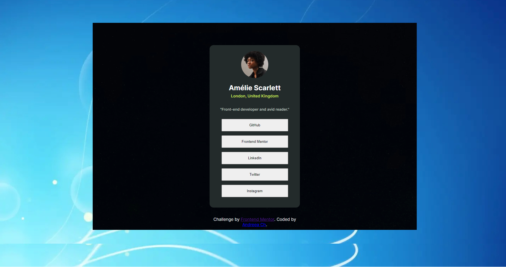
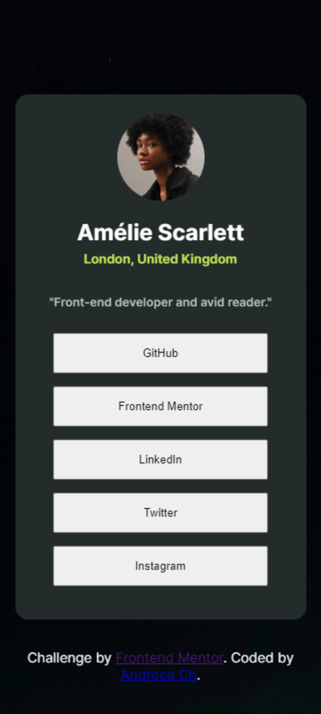

# Frontend Mentor - Social links profile solution

This is a solution to the [Social links profile challenge on Frontend Mentor](https://www.frontendmentor.io/challenges/social-links-profile-UG32l9m6dQ). Frontend Mentor challenges help you improve your coding skills by building realistic projects. 

## Table of contents

- [Overview](#overview)
  - [The challenge](#the-challenge)
  - [Screenshot](#screenshot)
  - [Links](#links)
  - [My process](#my-process)
  - [Built with](#built-with)
  - [Other tools used](#other-tools-used)
  - [What I learned](#what-i-learned)
  - [Useful resources](#useful-resources)


## Overview

### The challenge

Users should be able to:

- See hover and focus states for all interactive elements on the page

### Screenshot

![]
![]


### Links

- Solution URL: [https://github.com/andr-ch/Social-links-profile.git]
- Live Site URL: [https://andr-ch.github.io/Social-links-profile/]

## My process

### Built with

- Semantic HTML5 markup
- CSS custom properties
- Flexbox
- CSS Grid
- Mobile-first workflow

### Other tools used:
- Pesticide extension -> this is perfect to outline eacth element to better see the placement on the page  
- Developer tools -> available on any browser and is ideal for experimenting with changes to your page without affecting your code


### What I learned

1. Enhancing the project background and resizing it to cover the entire body container while preserving its aspect ratio:
```css
background: url(images/windows-7-wallpaper-1440x900.jpg) center fixed;
background-size: cover;
```

2. Reducing the font size for the header section:
```css
font-size: small;
```

3. Applying hover effects to buttons and enhancing their appearance:
```css
background-color: #C0E74D;
box-shadow: 10px 5px 5px rgb(0, 0, 0);
cursor: pointer;
font-weight: bold;
color: #4863A0;
border-radius: 15px;
```

4. Eliminating body margin to ensure the layout starts from the top of the page:
```css
html, body {
    margin: 0;
    padding: 0;
}
```

5. Rounding the corners of a container:
```css
border-radius: 15px 15px 15px 15px;
```

6. Structuring and arranging social link buttons to appear vertically stacked:
```css
.btn-group {
    display: flex;
    flex-direction: column;
    align-items: center;
    margin-top: 14px;
}
```

7. Adding spacing between buttons and adjusting their dimensions to match the template:
```css
.btn-group button {
    height: 47px;
    width: 251px;
    margin-bottom: 12px;
}
```

8. Making the edges of a profile picture round:
```css
.circular {
    border-radius: 50%;
}
}
```

9. Centering the text within a container:
```css
.content {
    text-align: center;
}
```

10. Preventing the background image from scrolling with the page:
```css
.element {
    background-attachment: fixed;
}
```

11. Centering the second background using flexbox properties:
```css
.element {
    display: flex;
    justify-content: center;
    align-items: center;
}
```

12. Making the element container responsive by adjusting its width and height based on viewport size:
```css
.element {
    width: 100vw;
    height: 100vh;
}
```

13. Implementing responsive behavior using media queries:
```css
@media 
    .element {... - CSS styles
  }
```

14. Adjusting container dimensions and spacing for desktop views with viewport width of 768px or more:
```css
@media (min-width: 768px) {
    .element {
        height: 44.5rem;
        width: 76.25rem;
        margin: 87px auto;
        padding-top: 34px;
        padding-bottom: 34px;
    }
}
```

15. Ensuring the background image extends to cover the entire viewport height in mobile view while preserving the background in desktop view:
```css
.element {
    background-size: cover;
    background-attachment: fixed;
}
```

16. Using relative positioning to move text vertically upwards:
```css
.location {
    position: relative;
    bottom: 12px;
}
```

17. Maintaining consistent font size across different devices and screen sizes using the "rem" unit:
```css
.location {
    font-size: 0.9375rem;
}
```

18. Adjusting the profile picture size to match the template:
```css
.profile-pic {
    max-width: 30%;
}
```

19. Creating an HTML button that functions similarly to a hyperlink:
```html
<a href="https://github.com/">
    <button>GitHub</button>
</a>
```

### Useful resources

- [Example resource 1](https://developer.mozilla.org/en-US/) - This resource proved valuable to me when I had to search for specific HTML or CSS elements for my project. I highly recommend this site to anyone looking to initiate their learning journey in HTML and CSS. It also offers a comprehensive set of learning materials tailored for novice developers and students.

- [Example resource 2](https://www.w3schools.com/) - This is additionally valuable for refining coding skills, and the "try me" section is beneficial if you wish to observe the code in action.

- [Example resource 3](https://www.sitepoint.com/) - Good to find a range of resources including articles, tutorials, books, and online courses covering various topics such as HTML, CSS, JavaScript, PHP, UX/UI design, and more.
